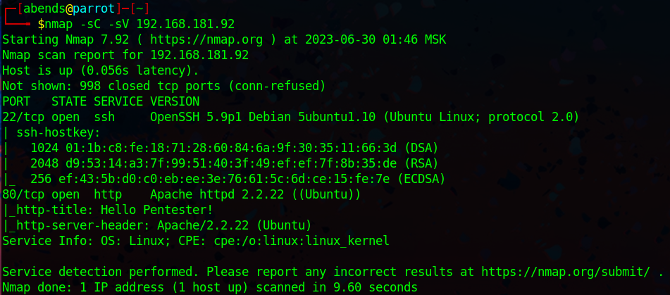
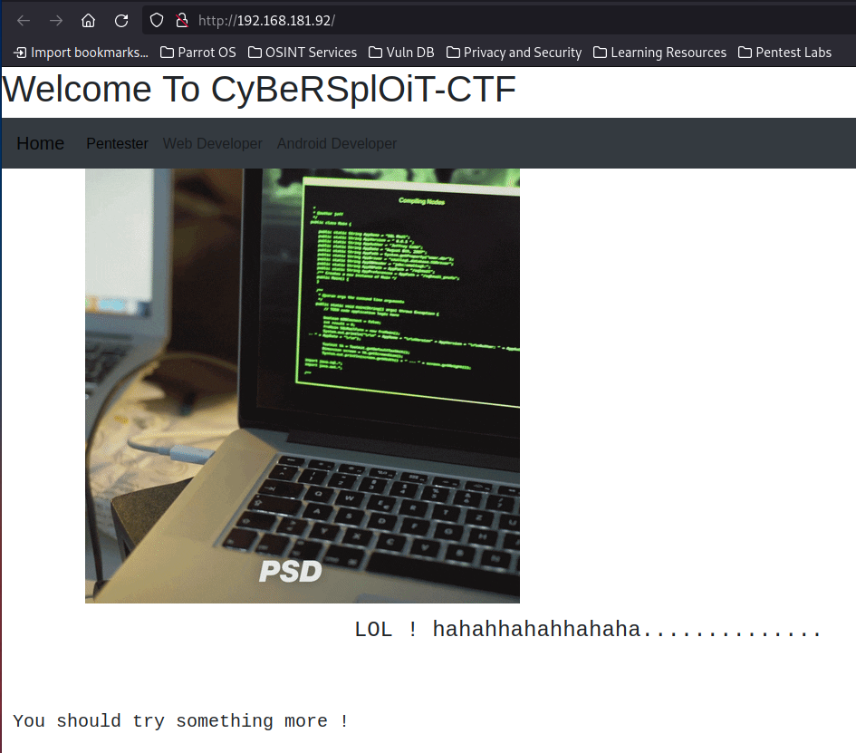
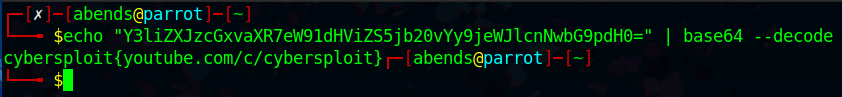
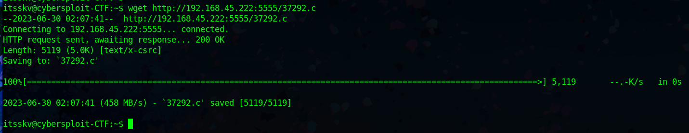

# Offensive Security: CyberSploit1

Используем Nmap для сканирования машины:
```sh
nmap -sC -sV 192.168.181.92
```


Мы нашли:
- 22 port - SSH (OpenSSH 5.9p1)
- 80 port - HTTP (Apache httpd 2.2.22)

Первым делом, перейдем на сайт:



В исходном коде страницы находим **username:itsskv**:


Запустим процесс сканирования директорий сайта:


Перейдем по пути **/robots**:


Тут находится строка в формате base64, сразу же декодируем ее:



Тут пришлось долго помучиться... В итоге приходим к тому, что полученная ссылка и есть пароль от SSH:


**SSH User: itsskv**

**SSH Password: cybersploit{youtube.com/c/cybersploit}**

### Question 1: User flag?

Получаем первый флаг:


### Question 2: Root flag?

Проверим, sudo-привилегии пользователя **itsskv**:


Мы не можем использовать sudo. Проверим, есть ли в системе директории других пользователей:


Обнаруживаем директорию пользователя **cybersploit**, но эта находка не привела к какому-либо результату.

Далее пришлось долго копаться, к тому же воспользоваться подсказкой... Проверим версию ядра системы:


Ищем эксплойты для данной версии ядра (3.13.0):


Качаем найденный эксплойт, который позволяет повысить привилегии до root'а в системе. Затем открываем http-сервер средствами Python:


Скачиваем файл через **wget** на хост-жертву:



Назначаем права на выполнение скачанного файла:


Проверяем наличие gcc:


Компилируем:


Запускаем скомпилированный эксплойт и получаем root'а:


Забираем последний флаг:


