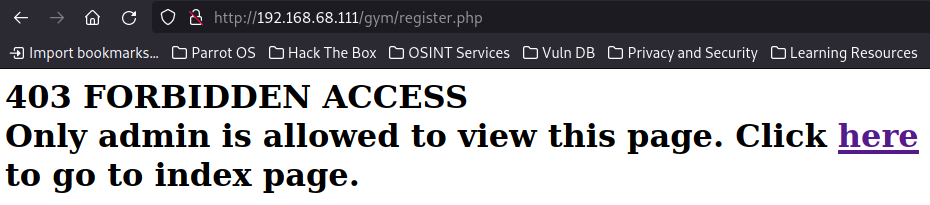
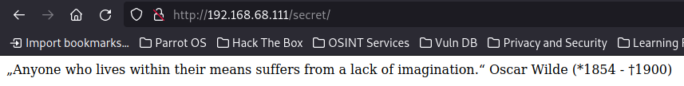
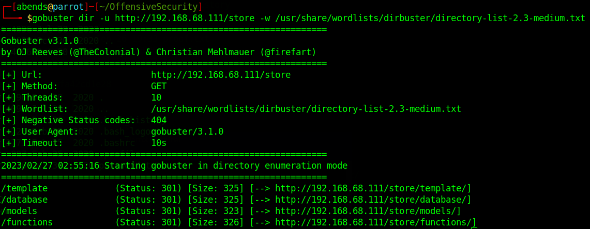
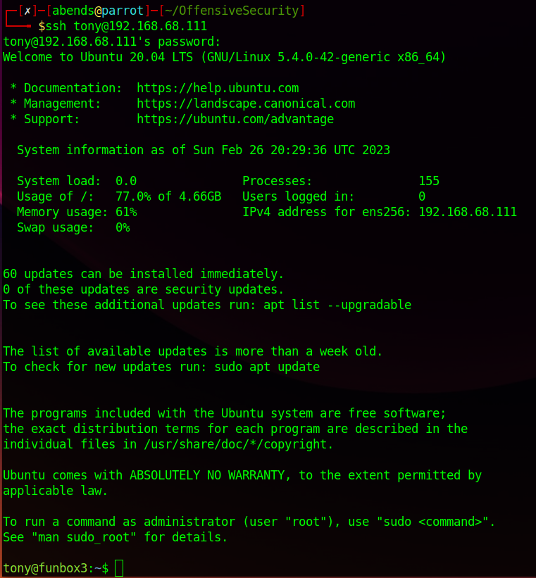

# Offensive Security: FunboxEasy

Используем nmap для сканирования машины:
```sh
nmap -sC -sV 192.168.68.111
```


Мы нашли:
- 22 port - SSH (OpenSSH 8.2p1)
- 80 port - HTTP (Apache httpd 2.4.41)

Интересно, что *nmap* уже на данный момент смог определить файл *robots.txt* на 80 порте, где прописан 1 запрещенный путь - */gym*:


Перейдем на сайт. В корневой директории сайта располагается дефолтная страница Apache2:


Посмотрим, что у нас находится в директории */gym*:


Находим простой сайт, посвященный спортнивной тематике. Каким-либо образом провзаимодействовать с полями ввода не представилось возможным. При исследовании файлов сайта был обнаружен файл *register.php*:


Проверим, что находится в этом файле:



В остальных местах (файлы в инспекторе) ничего существенного найдено не было, поэтому было запущено сканирование директорий сайта:
```sh
gobuster dir -u http://192.168.68.111 -w /usr/share/wordlists/dirbuster/directory-list-2.3-medium.txt
```


Результат поиска показал нам 3 дополниьельные директории:
- /store
- /admin
- /secret

Перейдем в раздел */secret*:



Интересно, то ли это действительно какая-то подсказка, то ли нас пытаются запутать. Посмотрим, может нам еще это пригодится.

Заглянем в */admin*:


Исследовав это направление, тоже, к сожалению, ничего интересного найти не удалось

Остается посмотреть */store*:


Тут уже располагается целый сайт по продаже книг. Далее можно перейти в раздел Admin Login, ссылка на который располагается внизу страницы (см. скрин выше). Далее я действительно наугад подобрал логин и пароль, потому что эти данные для входа крайне очевидны (login: admin; password: admin), но это не значит, что данные для входа можно определить только таким путем, просто мне повезло, поэтому давайте последовательно определим данные для входа. Для начала еще просканируем директории, но уже на сайте с книгами: 
```sh
gobuster dir -u http://192.168.68.111/store -w /usr/share/wordlists/dirbuster/directory-list-2.3-medium.txt
```



Переходим в директорию */database* и находим там файл *readme.txt*, тут как раз-таки можно найти это самые данные для входа. Причем эти же данные лежат и файле с расширением .sql:


Авторизуемся на сайте с найденными данными:


Видим книги, которые уже располагаются на сайте, но самое интересное это то, что мы можем сами добавить книгу:


Пробуем непосредственно добавить раздел с книгой, попутно пробуя на некоторые web-уязвимости:


С такими введенными данными получаем ошибку в графе *Publisher*, поэтому заменим тестовые цифры на автора, который уже фигурировал в книгах на сайте:


Как видим, вместе с этим мы пытаемся загрузить не картинку, а скрипт для получения reverse shell, который мы предварительно правильно сконфигурировали:


В итоге у нас получается создать раздел с "книгой":


Теперь в отдельном терминале прослушиваем порт, прописанный ранее в скрипте:


Нажимаем на битую иконку картинки в разделе с книгой (она к меня впоследствии меняется на круг), либо же используем curl для активации:


Получаем reverse shell на прослушиваемом порте:


### Question 1: User flag?
Обнаруживаем, что на данный момент мы являемся пользователем www-data. Посмотрим на команды, которые мы можем выполнить с sudo-привилегиями:


И тут понимаем, что такого рода команды нам не доступны. Тогда посмотрим "стандартные" места в системе и попробуем найти флаг. Для начала я посмотрел в папках пользователей системы, но там я нашел кое-что интереснее, нежели user-флаг, но об этом немного позже. Дальше посмотрел в еще нескольких местах и в конечном счете первый флаг оказался в */var/www/local.txt*:


### Question 2: Root flag?
Возвращаемся к пользователям. В папке */home* мне удалось обнаружить раздел пользователя tony, где нашелся файл *password.txt*:


На самом деле на сайте достаточно много разделов (помним, что сайтов как мимниму два), поэтому не сразу было понятно, что и куда относится. К SSH мы перейдем позже, сначала разберемся с данными для /store. Как удалось выяснить, пара *email* - *password* подходит для авторизации на сайте книжного магазина точно так же, как и пара admin - admin.


А вот на сайте, связанном со спортом с паролем asdfghjklXXX авторизоваться не удалось, причем в процессе были найдены и другие места, куда можно было бы войти в качестве админа, но я в итоге так никуда и не попал с этим паролем и логином admin. 


Далее смотрим в сторону SSH. Используем данные для входа: **tony** и **yxcvbnmYYY**:



Вновь посмотрим на команды, которые мы можем выполнить с sudo-привилегиями:


Сразу отмечу, что файл *.smile.sh* у меня открыть или же прочитать не получилось, зато я сразу обнаружил, что нам доступна команда **/usr/bin/time**. На GTFORBins находим, как повысить привилегии с помощью этой команды:


Применяем найденную команду:


Мы повысили привилегии. Root-флаг лежит в директории */root* в файле *root.flag*:


