# Offensive Security: FunboxRookie

Для начала произведем сканирование целевого хоста при помощи Nmap:
```sh
nmap -sC -sV 192.168.181.107
```

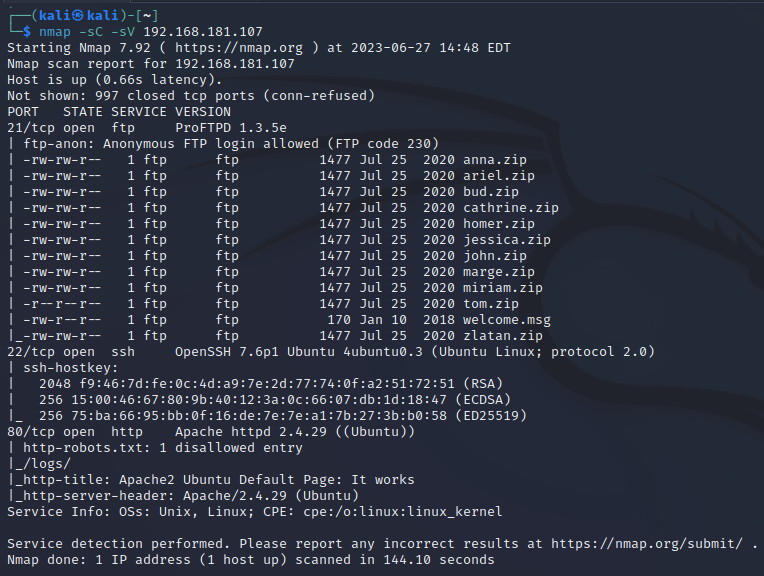

Найдено:
- 21 port - FTP (ProFTPD 1.3.5e)
- 22 port - SSH (OpenSSH 7.6p1)
- 80 port - HTTP (Apache httpd 2.4.29)

Проверим сайт, который расположен на 80 порте:

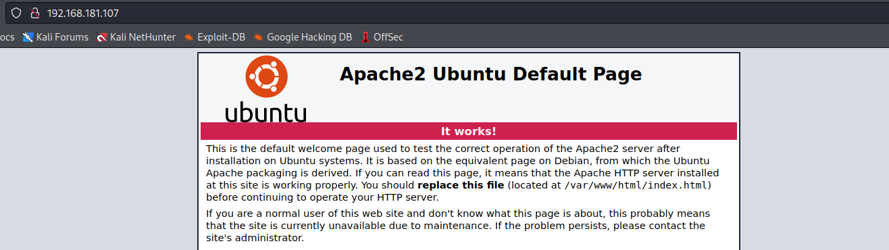

Nmap показал наличие на сайте файла **robots.txt**:

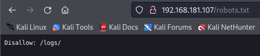

Тут находим **/logs/**, но внутри ничего не обнаружено:

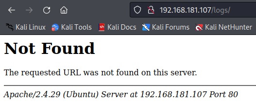

В таком случае смотрим в сторону FTP-сервера. Заходим под аккаунтом **anonymous**:

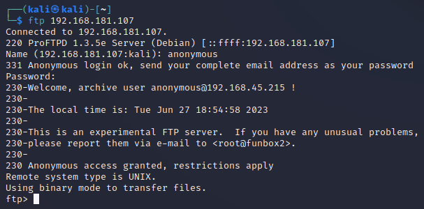

Ранее Nmap определил список файлов, которые находятся на сервере. Они все похожи, но только один из них - **tom.zip**, отличается от других выданными правами (**-rw-rw-r--**). Скачаем себе данный архив:

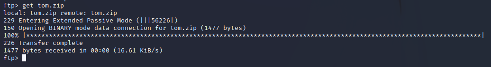

Архив имеет пароль, поэтому сначала получаем хэш, а затем брутим его и получаем пароль - **iubire**:

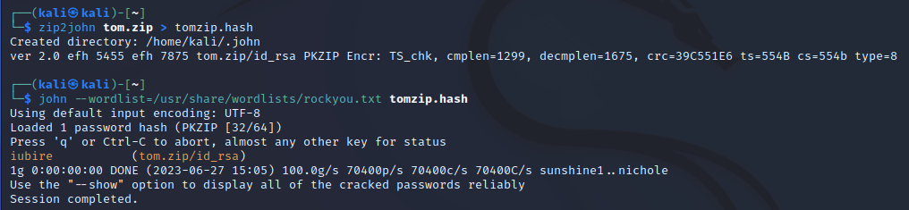

Внутри расположен приватный RSA-ключ для подключения по SSH:

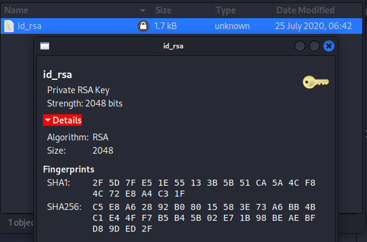

Перемещаем ключ из архива (я поместил на рабочий стол) и выполняем подключение по SSH:
```sh
ssh -i Desktop/id_rsa tom@192.168.181.107
```

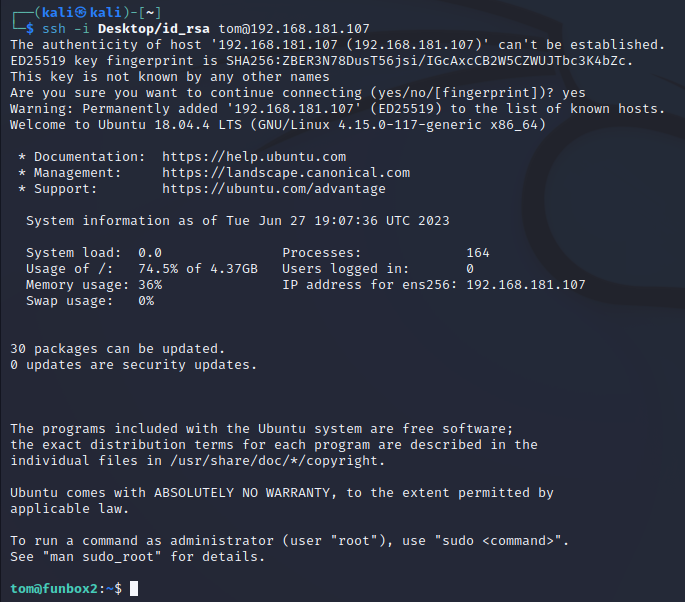

### Question 1: User flag?

Собственно, читаем первый флаг:

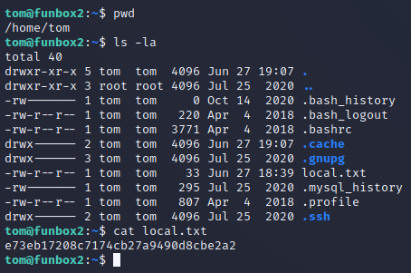

Далее, в домашнем каталоге пользователя **tom**, находим файл **.mysql_history**, где находим пароль от УЗ **tom** - **xx11yy22!**:

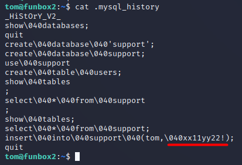

### Question 2: Root flag?

Проверяем, какие команды мы можем исполнять от лица sudo:

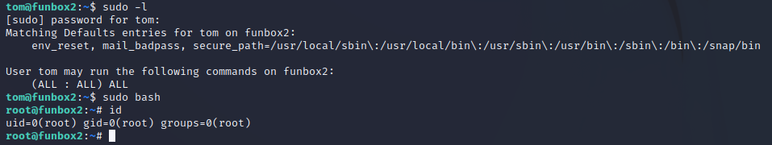

Мы можем выполнять любые команды... Просто вызываем bash с использованием sudo и получаем доступ к УЗ **root**. Остается только прочитать второй флаг:

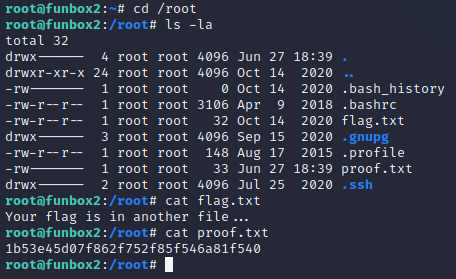
