# Offensive Security: Gaara

Используем nmap для сканирования машины:
```sh
nmap -sC -sV 10.10.124.86
```
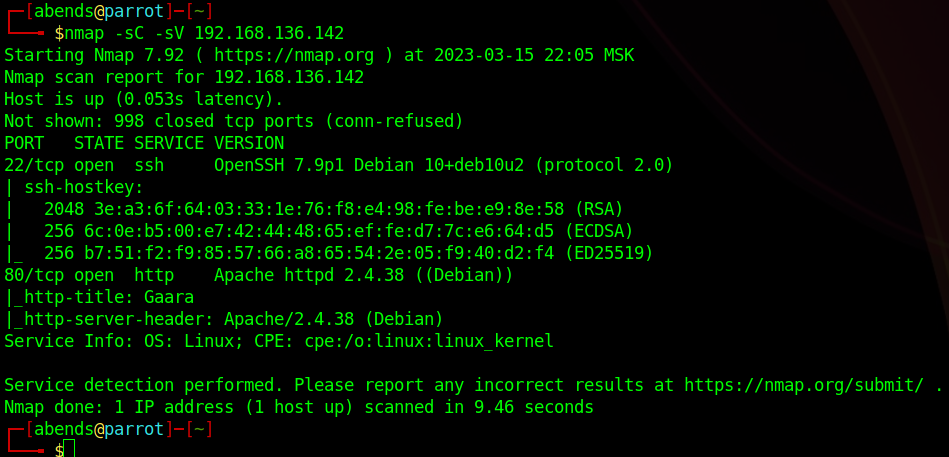

Мы нашли:
- 22 port - SSH (OpenSSH 7.9p1)
- 80 port - HTTP (Apache httpd 2.4.38)

Перейдем на сайт:

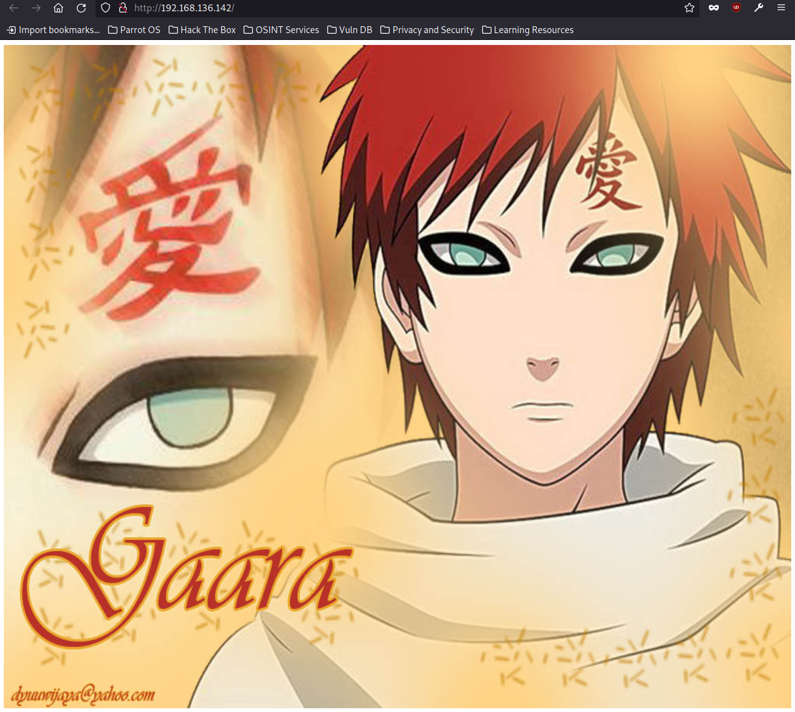

Видим только картинку. В исходном ноде старницы ничего интересного не обнаружено. В таком случае просканируем директории:
```sh
gobuster dir -u http://192.168.136.142/ -w /usr/share/wordlists/dirbuster/directory-list-lowercase-2.3-medium.txt
```
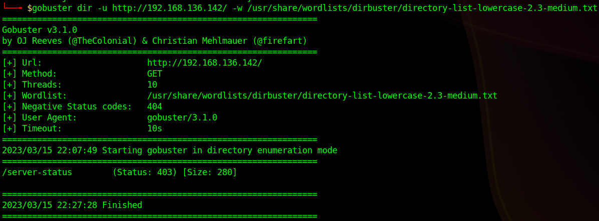

А вот еще интереснее - директории не найдены **:/**
В таком случаем присмотримся более детально к картинке и заметим надпись **gaara**. Учитывая, что у нас есть только SSH, может ли это являться логином? - Вполне. Тогда попробуем узнать пароль при помощи hydra:
```sh
hydra -l gaara -P /usr/share/wordlists/rockyou.txt 192.168.136.142 ssh
```
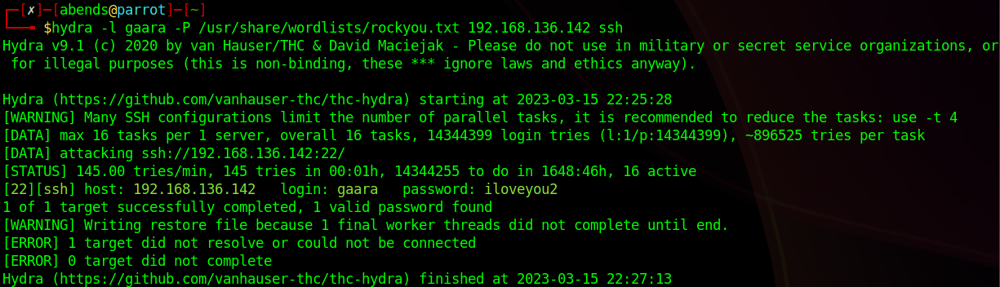

И да! Пароль мы узнали, пробуем войти:

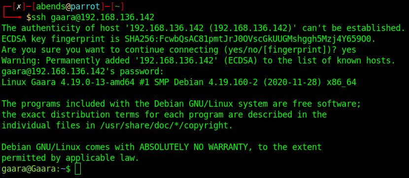

Мы внутри, забираем первый флаг в директории пользователя gaara:

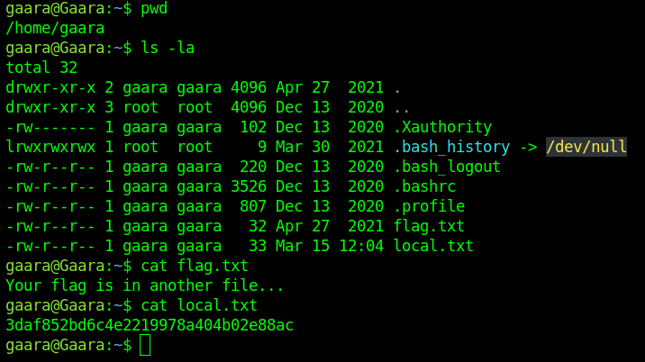

Посмотрим, что наш пользователя может выполнять от лица sudo:

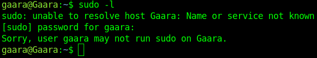

К сожалению, пользователь не принадлежит к группе sudo. Тут немного отвлечемся - мне стало интересно, неужели на сайте не больше директорий? Оказывается, есть, просто у них специфичные названия:

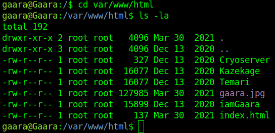

Возвращаемся к повышению привилегий. Попробуем ввести следующую команду для того, чтобы посмотреть, что мы можем запустить с более высокими правами:
```sh
find / -user root -perm -4000 -exec ls -ldb {} \;
```
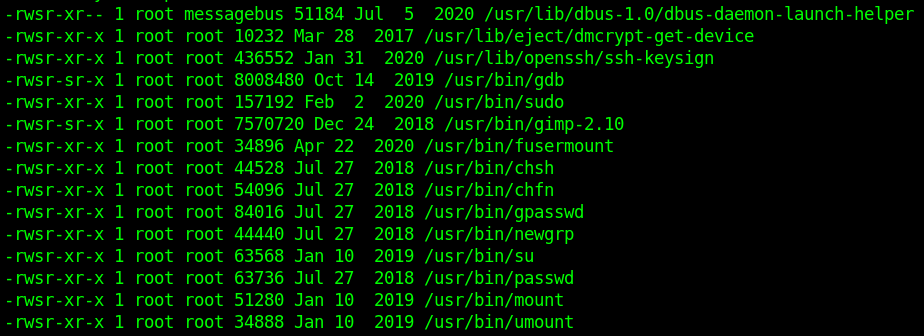

Из доступного нас интересует либо gimp, либо gdb. Плюс, проверим, есть ли python:

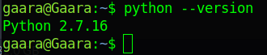

Взять под контроль root'а через gimp мне не удалось, хотя может я просто делал что-то немного не так, но вот через gdb все прошло успешно:
```sh
gdb -nx -ex 'python import os; os.execl("/bin/sh", "sh", "-p")' -ex quit
```
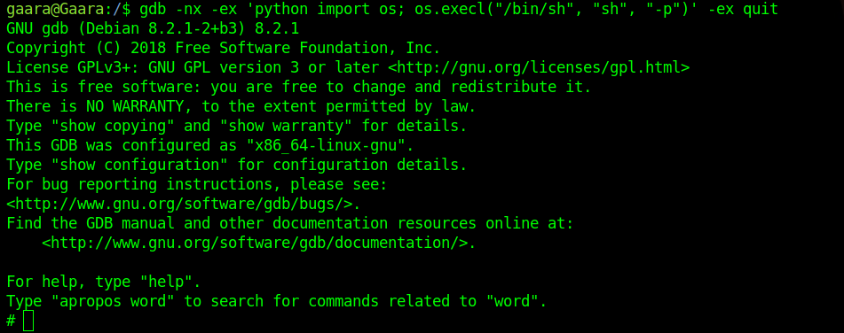

За основу взято следующее:

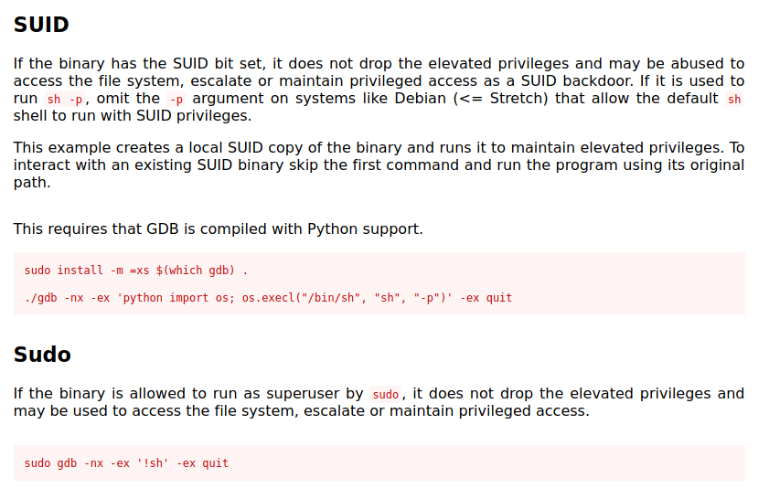

Забираем root-флаг:

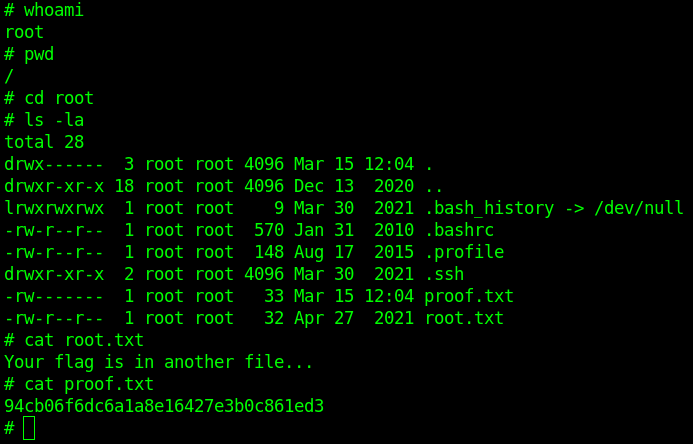
