# Offensive Security: InfosecPrep

Используем nmap для сканирования машины:
```sh
nmap -sC -sV 192.168.133.89
```
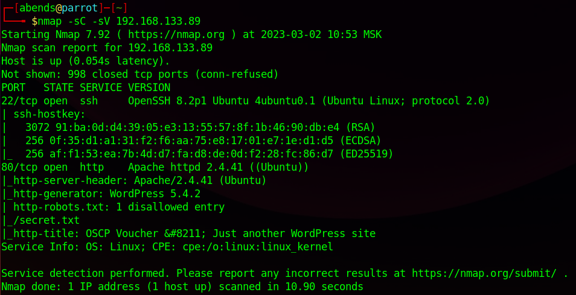

Мы нашли:
- 22 port - SSH (OpenSSH 8.2p1)
- 80 port - HTTP (Apache httpd 2.4.41)

По итогам сканирования можно сразу заметить, что ресурс на 80 порте функционирует на WordPress 5.4.2, а также можно обратить внимание на robots.txt, где прописан один запрещенный вход на **/secret.txt**. Перейдем и посмотрим сам ресурс:

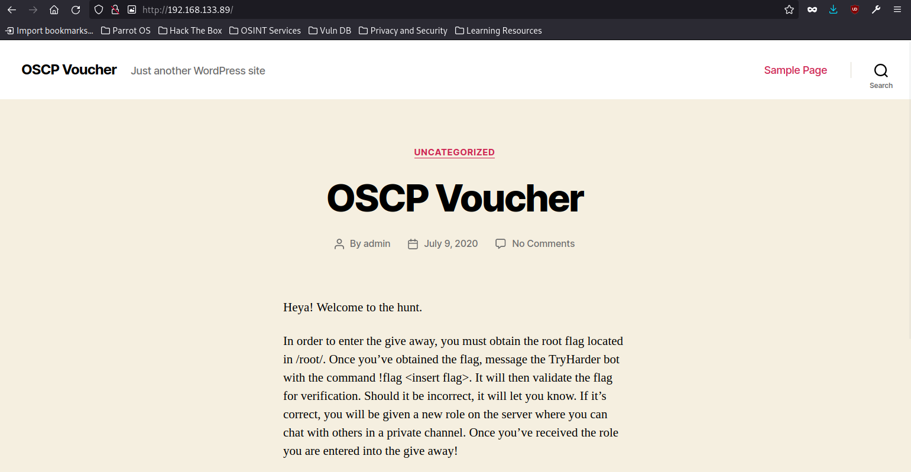

На сайте особенно интересного ничего нет (в плане функционала), а вот по информационному наполнению очень интересно. Во-первых, нам сразу же дают понять, где находится один из флагов - это директория **/root**. Во-вторых, мы узнаем, что пользователь в данном случае один - **oscp**

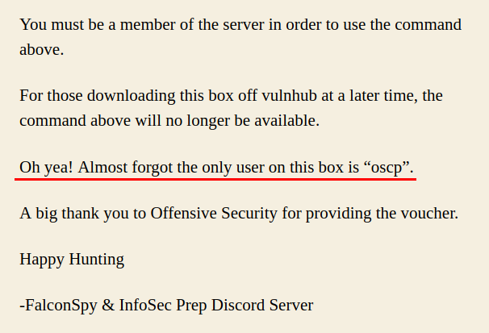

Теперь перейдем в директорию **/secret.txt*:

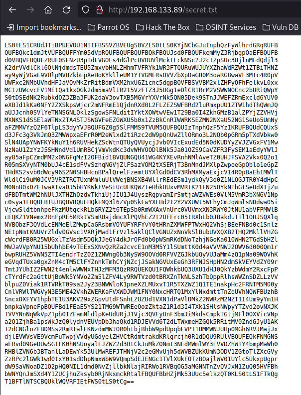

Видим что-то зашифрованное, скорее всего, при помощи base64, судя по тому, что в конце стоит два знака равно ("...**==**"). Скопируем текст и создадим текстовый файл, куда перенесем скопированную информацию:

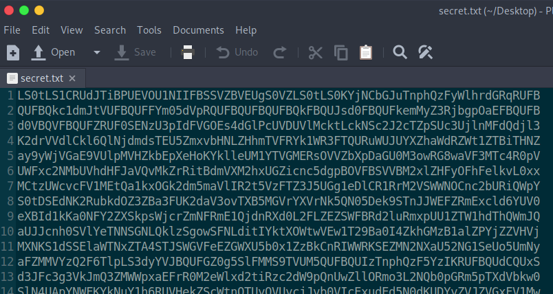

Далее декодируем информацию из файла и результат переносим в другой файл:

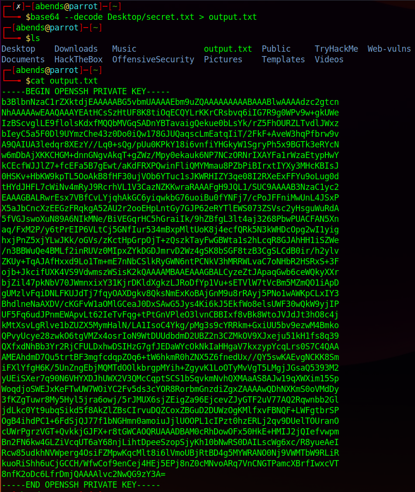

В итоге мы получили приватный SSH-ключ. Соответственно, у нас есть ключ, есть имя пользователя, тогда попробуем пдключиться по SSH к целевой машине. Но перед этим я для удобства перенес файл с ключом на рабочий стол, переименовал его (**ssh-key.txt**), затем этому файлу присовены права с номером 600:
```sh
mv output.txt Desktop/ssh-key.txt
```

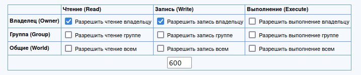

Если не изменить права, то мы не сможем войти, получив сообщение следующего вида:

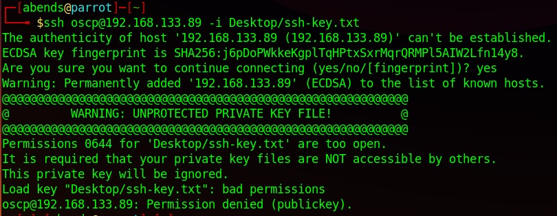

Непосредственно, вход:

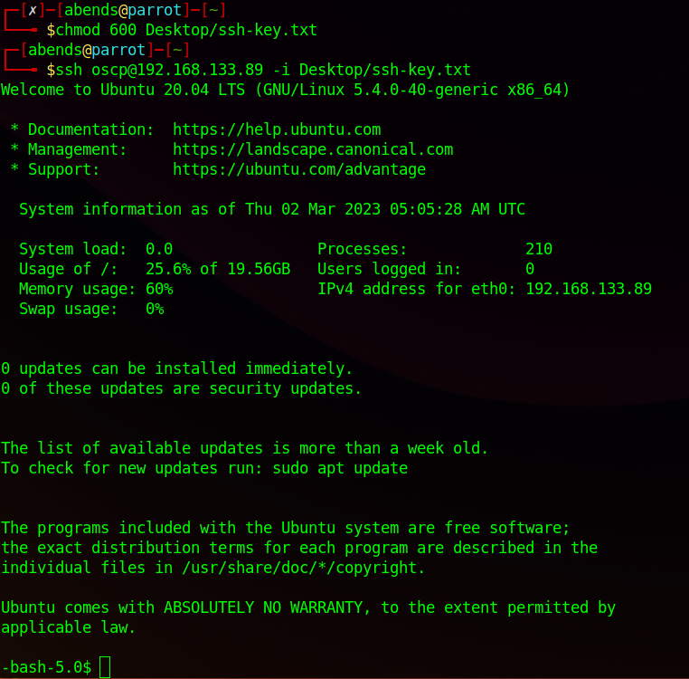

Сразу посмотрим директорию пользователя **oscp**. В файле *local.txt* обнаруживаем первый флаг:

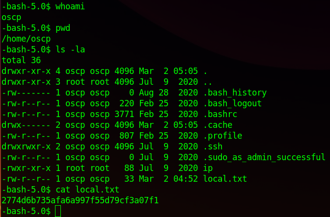

Далее повышаем привилегии. При помощи соответствующей команды посмотрим, какие операции мы можем выполнять от имени sudo:
```sh
sudo -l
```
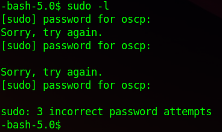

Делаем вывод о том, что у нас нет доступа к sudo в принципе. Там, где мы нашли первый флаг, есть файл **ip**, заглянем в него:

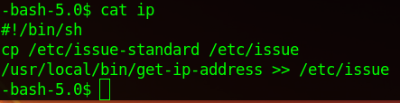

Это bash-скрипт. А вот теперь главный вопрос - можем ли мы запускать сам bash? Ответ на этот вопрос может быть получен разными путями, например, посмотрев на права файла, просто попробовав запустить найденный скрипт или же введя следующую команду:
```sh
find / -user root -perm /4000
```
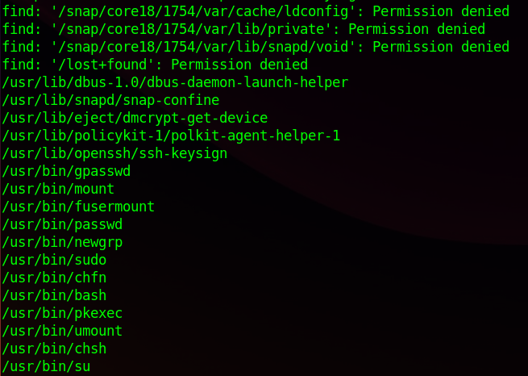

Да, вызвать bash мы можем, и вызываем мы его не просто так, а с root-правами:

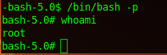

Возможно, вы заметили, что права доступа к /bin/bash немного изменены. Обычно /bin/bash не имеет установленного бита setuid:

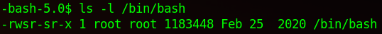

Осталось только забрать root-флаг:

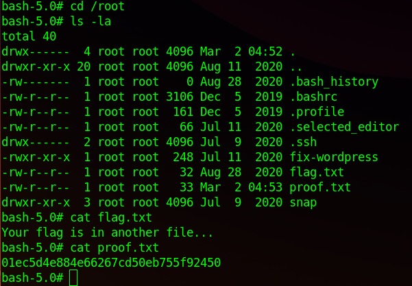
