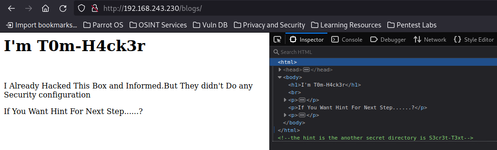

# Offensive Security: Moneybox

Используем Nmap для сканирования машины:
```sh
nmap -sC -sV 192.168.243.230
```


Мы нашли:
- 21 port - FTP (vsftpd 3.0.3)
- 22 port - SSH (OpenSSH 7.9p1)
- 80 port - HTTP (Apache httpd 2.4.38)

Первым делом, перейдем на FTP-сервер, т.к. возможен вход через **anonymous**:


Находим файл **trytofind.jpg**, который скачиваем себе на хостовую машину:


Смотрим для начала этот файл через стандартные для стеганографии инструменты:


Пока тщетно, но проверить стоило. Теперь перейдем на сайт:


Не найдя ничего интересного на данной странице, переходим к сканированию директорий:
```sh
gobuster dir -u http://192.168.243.230 -w /usr/share/wordlists/dirb/common.txt
```


Находим директорию **/blogs**:



Перейдя к найденной директории и проверив исходный код старницы, обнаруживаем подсказку - секретная директория - **S3cre3t-T3xt**


Уже внутри самой секретной директории находим ключ - **3xtr4ctd4t4**. Попробуем применить данный ключ в **steghide**:


Нам удалось извлечь данные, которые были записаны в **data.txt**:


В сообщении говорится, что у пользователя **renu** установлен слабый пароль. Попробуем найти нужный пароль при помощи **hydra**:
```sh
hydra -l renu -P /usr/share/wordlists/rockyou.txt 192.168.243.230 ssh
```


Найденный пароль - **987654321**

### Question 1: User flag?

Подключаемся по найденным данным по SSH:


Забираем первый флаг:


### Question 2: Root flag?

Сразу проверим, что мы можем запускать от имени sudo:


Пользователь **renu** не может использовать sudo. Найти что-то интересное в crontab, а также SUID-файлы не удалось:


Проверим, есть ли в системе еще пользователи:


Обнаруживаем пользователя **lily**, а в директории **/.ssh** пользователя **renu** находим приватный RSA-ключ на подключение:


Посмотрим sudo-права у пользователя **lily**:


В нашем владении доступ до perl. На GTFORBins находим способ повышения привилегий до root-пользователя:


Применяем команду и забираем второй флаг:


