# Offensive Security: OnSystemShellDredd

Используем nmap для сканирования машины:

```sh
nmap -sC -sV 10.10.124.86
```

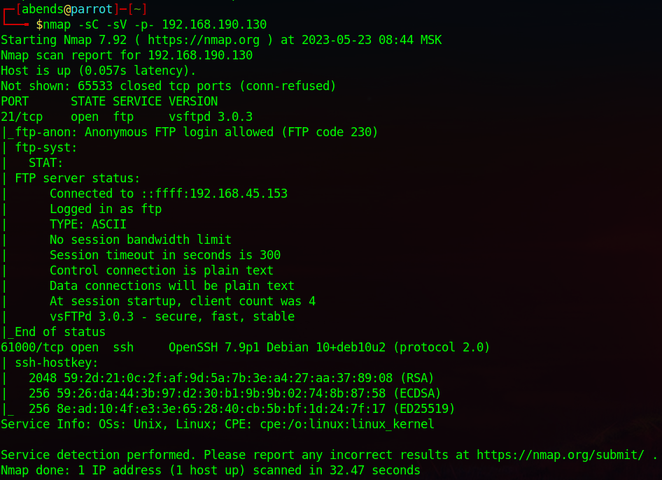

Мы нашли:
- 21 port - FTP (vsftpd 3.0.3)
- 61000 port - SSH (OpenSSH 7.9p1)

По результатам сканирования видно, что активна возможность входа на FTP-сервер под **Anonymous**. Зайдем на FTP-сервер:

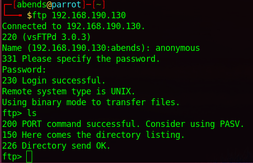

Изначально не видно никаких файлов, но стоит к команде **ls** добавить **-la** и мы обнаруживаем скрытую директорию **.hannah**:

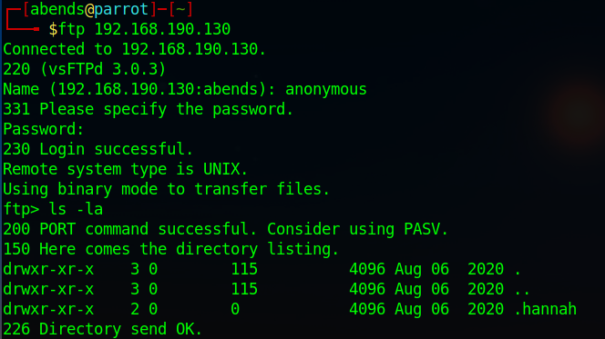

Перейдем в найденную директорию и посмотрием ее содержимое:

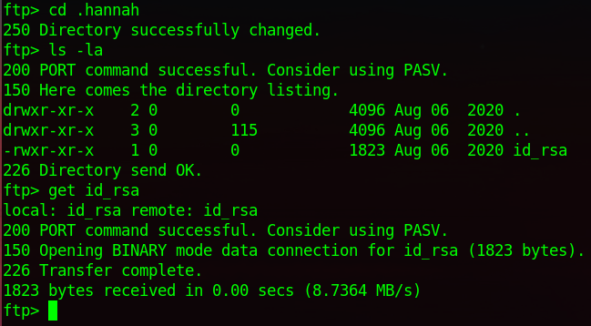

Находим файл **id_rsa**, скачаем его себе на хост, присвоим права 600 (владелец будет читать и писать, в то время как группа и все остальные не будут иметь никаких разрешений вообще). На данный момент у нас есть приватный ключ и логин для SSH. Пробуем подключиться к порту 61000:

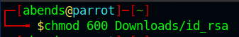

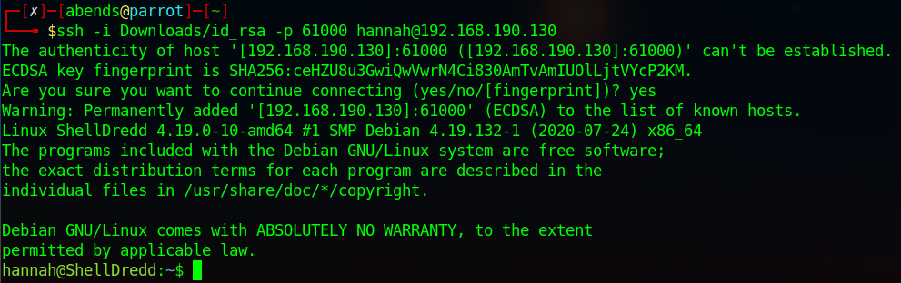

### Question 1: User flag?
Собственно, мы подключились по SSH к жертве и теперь можем прочитать user-флаг:

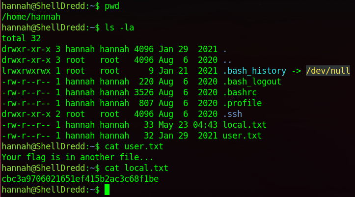

### Question 2: Root flag?
Пробуем посмотреть sudo-привилегии для пользователя, к которому мы имеем доступ:

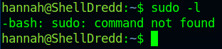

К сожалению, sudo мы использовать не можем, поэтому посмотрим команды с разрешением **SIUD** – это бит разрешения, который позволяет пользователю запускать исполняемый файл с правами владельца этого файла.
```sh
find / -perm -u=s -type f 2>/dev/null
```
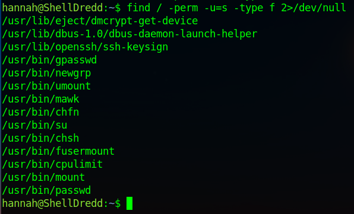

Среди всего прочего, у нас есть возможность исполнять команду **cpulimit**:

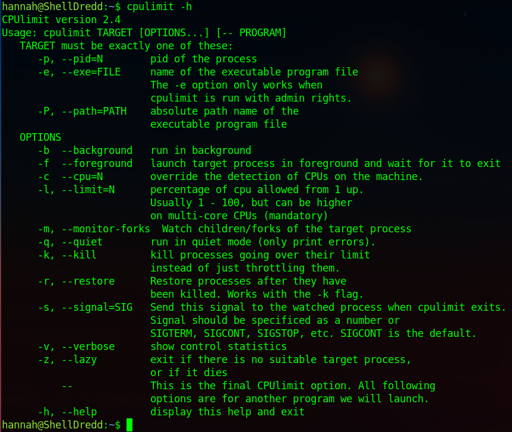

На GTFORBins находим способ повышения привилегий через вышеупомянутую команду и повышаем привилении до root-пользователя:
```sh
cpulimit -l 100 -f -- /bin/sh -p
```
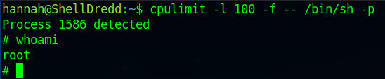

В конце читаем файл с root-флагом:

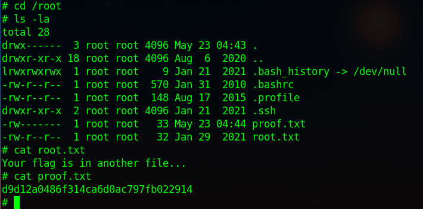

Альтернативный вариант чтения root-флага через утилиту **mawk**:

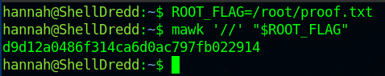

