# Offensive Security: Seppuku

Для начала произведем сканирование целевого хоста при помощи Nmap:

```sh
nmap -sC -sV -p- 192.168.186.90
```

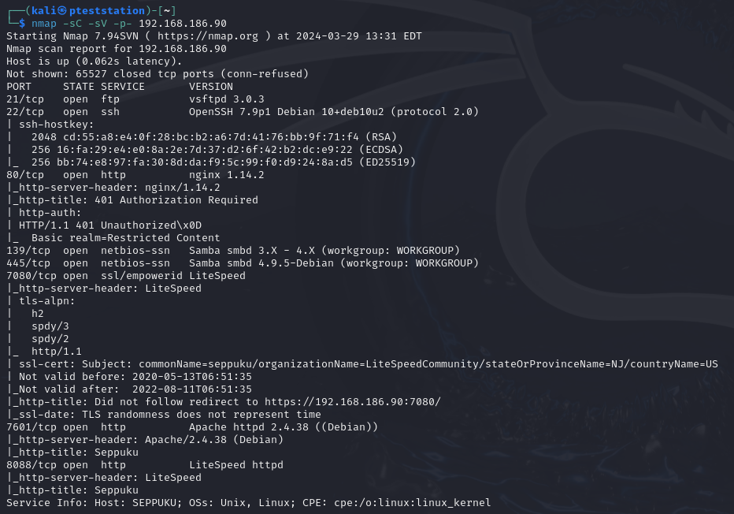

Найдено:
- 21 port - FTP (vsftpd 3.0.3)
- 22 port - SSH (OpenSSH 7.9p1)
- 80 port - HTTP (nginx 1.14.2)
- 7080 port - HTTP (LiteSpeed)
- 7601 port - HTTP (Apache httpd 2.4.38)
- 8088 port - HTTP (LiteSpeed httpd)

Осмотрим сайты:

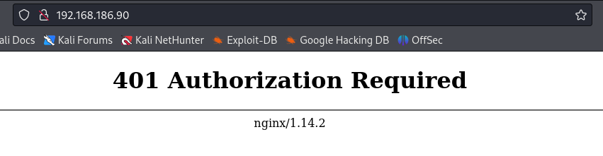

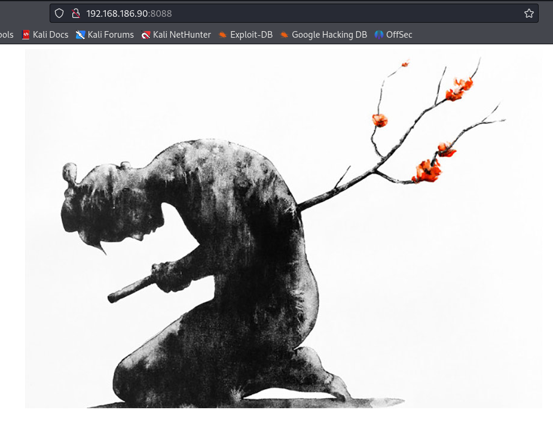

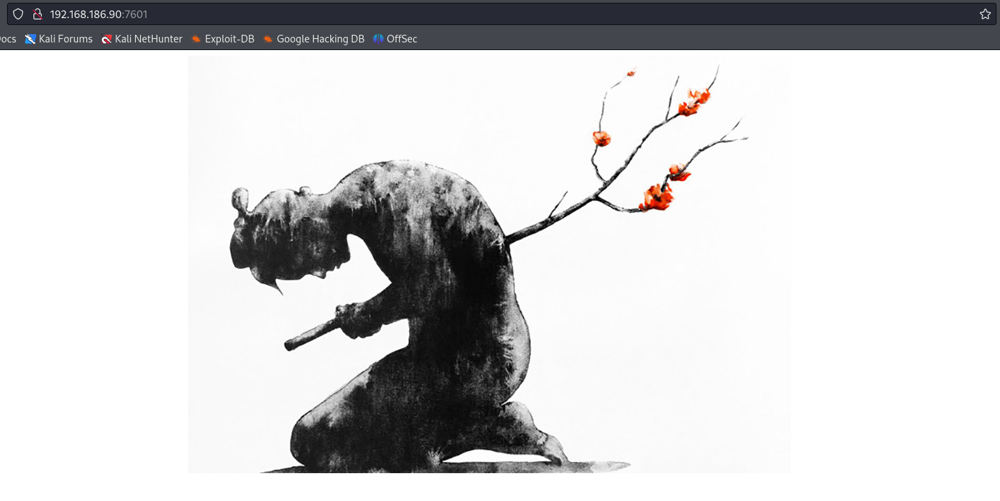

Интересного сходу замечено не было, поэтому сканируем директории через `wfuzz`:

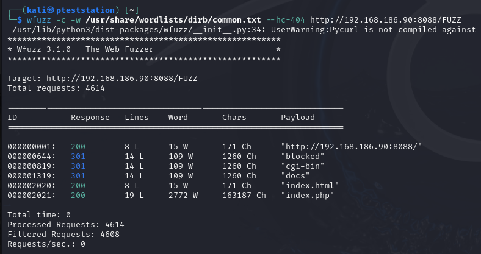

На веб-ресурсе, который расположен на порту 8088 находим `index.php`, где находится WebConsole, но пока, к сожалению, это нам ничего не дает, т.к. нет данных для авторизации:

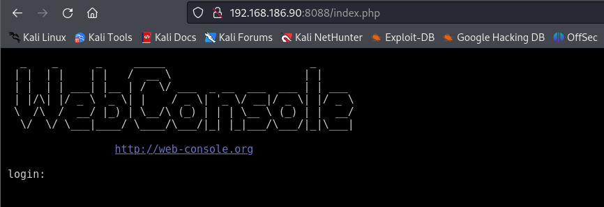

Продолжаем искать директории:

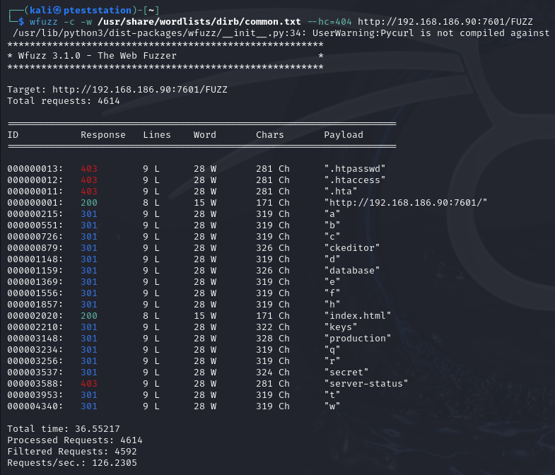

А вот сайт на порту 7601 куда более интереснее. Посмотрим на `/secret` и `/keys`:

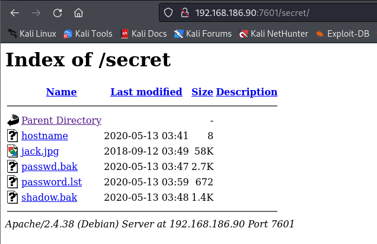

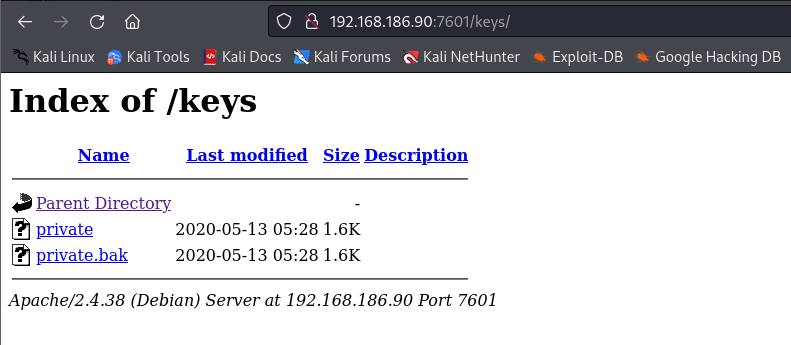

Находим файлы `/secret/password.lst` и `/secret/hostname`, а также `/keys/private`:

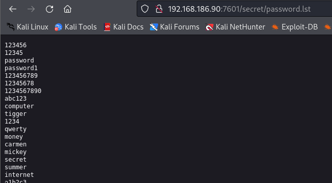

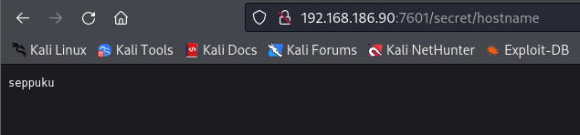

Логин и перечень паролей? Пробуем пробиться по SSH:

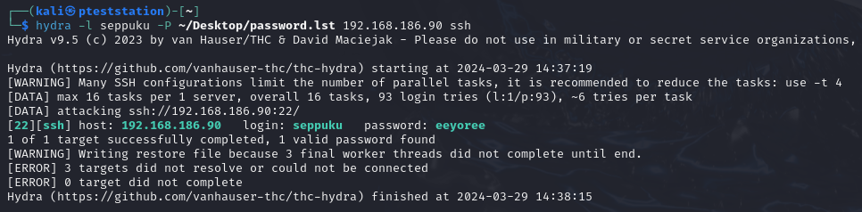

>seppuku:eeyoree

Подключаемся и забираем первый флаг:

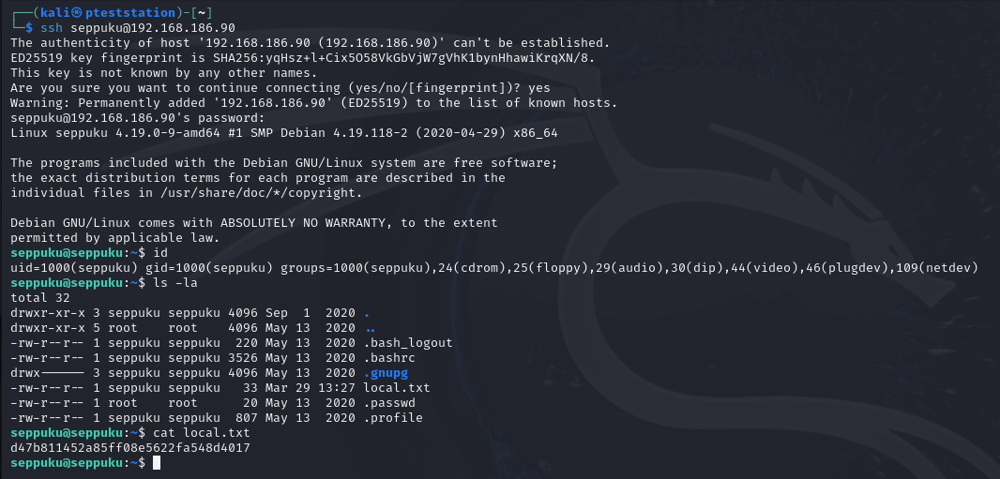

Находим пароль и узнаем, что он от пользователя `samurai`:

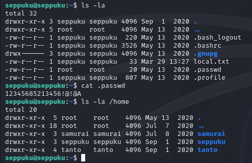

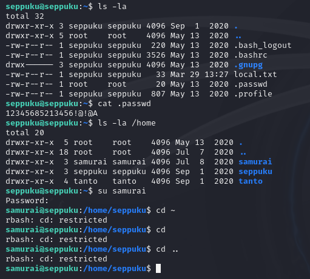

Интересно, что мы не можем перемещаться по директориям. Тогда сразу заглянем в права sudo:

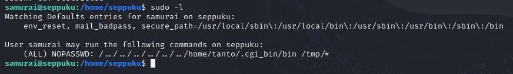

Интересная команда. В системе есть еще 1 пользователь - `tanto`. Копируем себе найденный приватный SSH-ключ и пробуем войти:

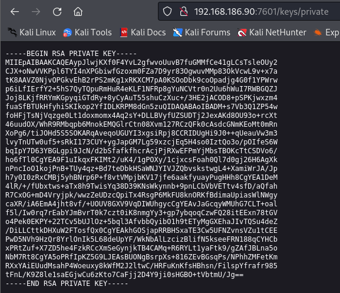

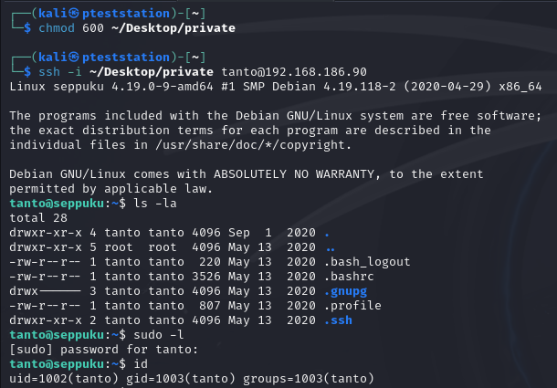

У нас успешно получилось войти. Т.к. у нас не работаем cd, воспользуемся опцией `-t "bash -noprofile"`. создаем файл `.cgi_bin/bin`, который открывает bash-оболочку:

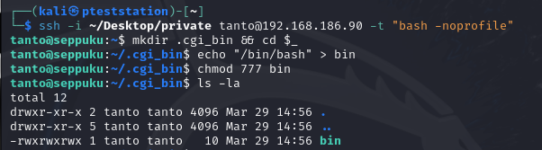

Переходим обратно на `samurai` и открываем созданный файл:

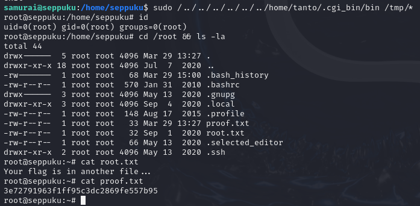

---

