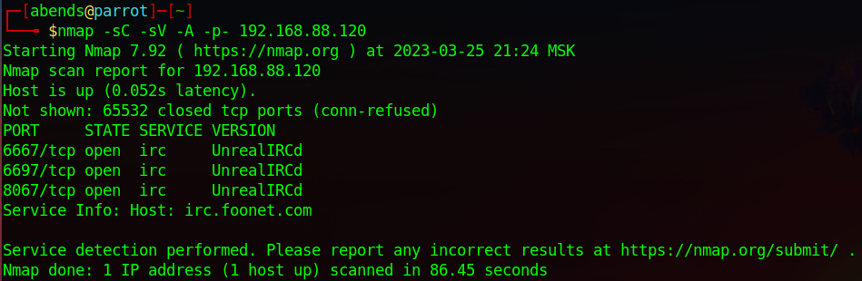
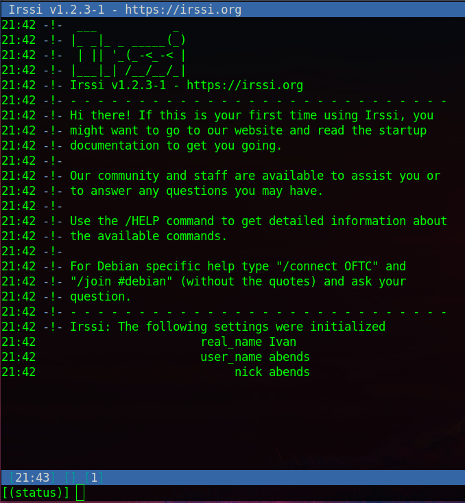
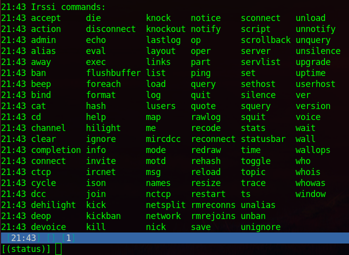
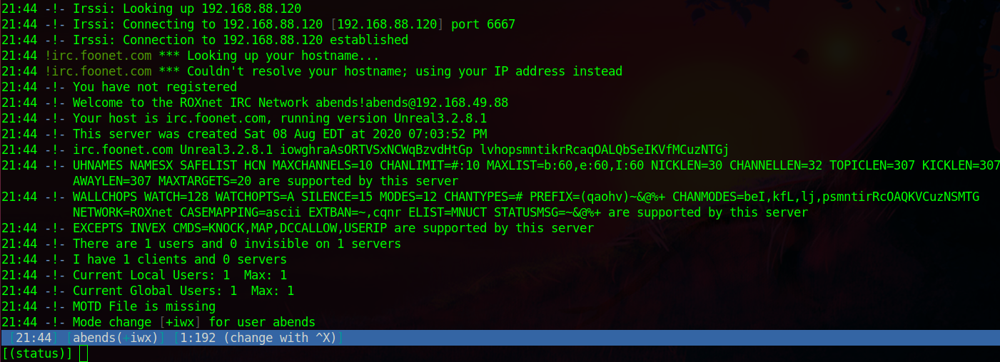
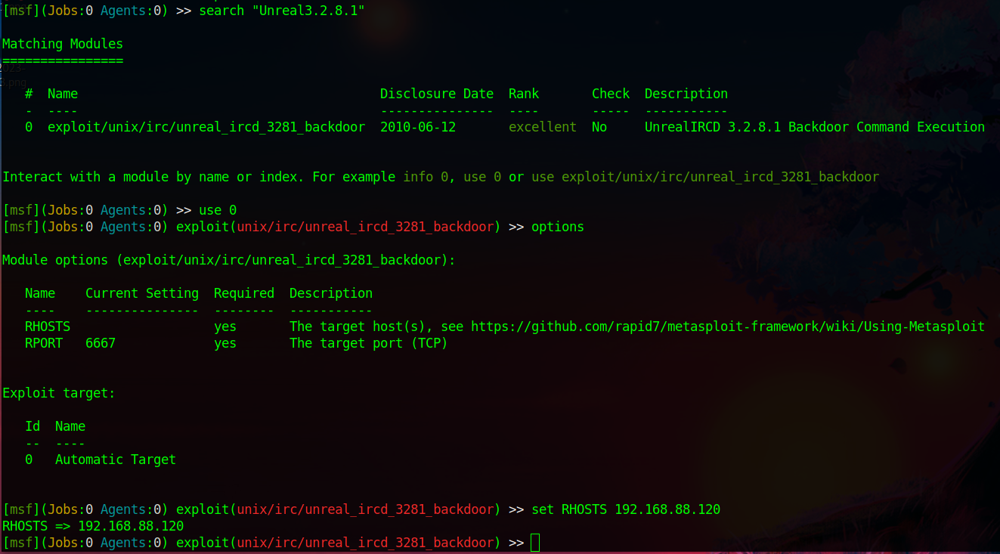
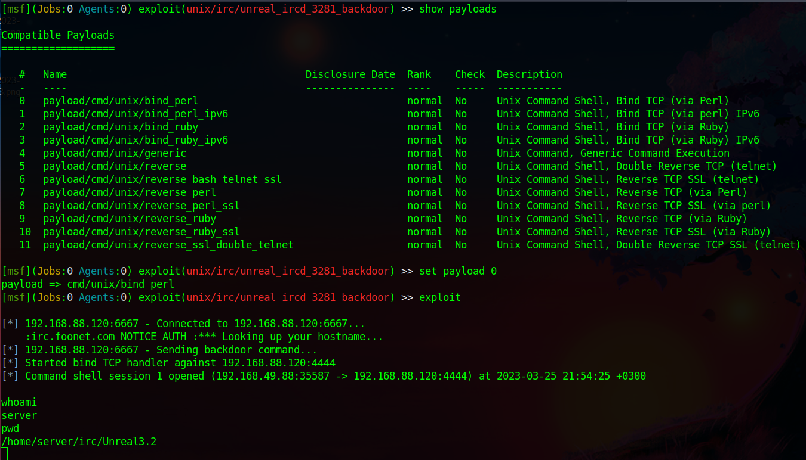
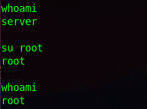
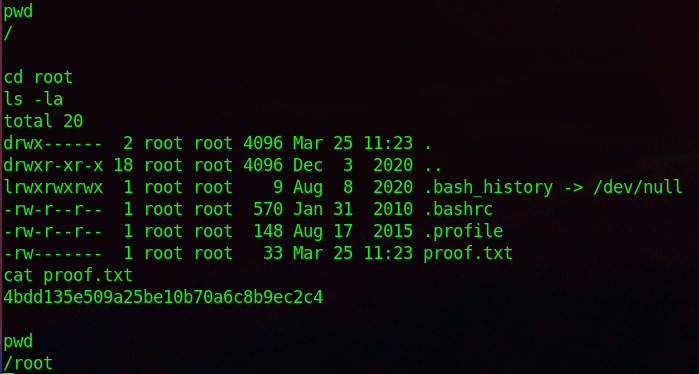
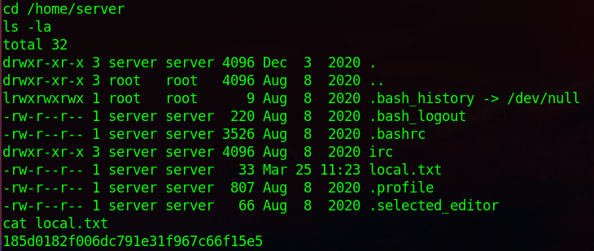

# Offensive Security: SunsetNoontide

Используем nmap для сканирования машины:
```sh
nmap -sC -sV -A -p- 192.168.88.120
```


Мы нашли:
- 6667 port - irc (UnrealIRCd) - стандартный порт службы IRC
- 6697 port - irc (UnrealIRCd) - стандартный порт службы IRC + TLS
- 8067 port - irc (UnrealIRCd)

Перед тем, как идти дальше, стоит разобраться в том, что из себя представляет данная служба. Вот, что нам может дать Википедия:
**IRC** (англ. *Internet Relay Chat*) — протокол прикладного уровня для обмена сообщениями в режиме реального времени. Разработан в основном для группового общения, также позволяет общаться через личные сообщения и обмениваться данными, в том числе файлами. IRC использует транспортный протокол TCP и криптографический TLS (опционально). Основная спецификация - RFC 1459. Согласно спецификациям протокола, IRC-сеть — это группа серверов, соединённых между собой.

IRC предоставляет возможность как группового, так и приватного общения. Для группового общения существует несколько возможностей. Пользователь может отправить сообщение списку пользователей, при этом серверу отправляется список, сервер выделяет из него отдельных пользователей и отправляет копию сообщения каждому из них. Более эффективным является использование каналов. В этом случае сообщение отправляется непосредственно серверу, а сервер отправляет его всем пользователям в канале. Как при групповом, так и при приватном общении сообщения отправляются клиентам по кратчайшему пути и видимы только отправителю, получателю и входящим в кратчайший путь серверам. 

В принципе, ничего сложного здесь нет, данный протокол заложил фундамент "*мессенджера*", где люди могут общаться как наедине, так и в группах.

Для того, чтобы иметь возможность взаимодействовать с данной сетевой службой, необходимо установить клиент IRC. В нашем случае, я буду использовать IRSSI, чтобы его установить, необходимо ввести следующее:
```sh
sudo apt-get install irssi -y
```

Запуск:
```sh
irssi
```



Список доступных команд:



Попробуем подклюяиться:
```sh
/connect 192.168.88.120
```



На картинке выше можно обнаружить версию службы - **Unreal3.2.8.1**. Если посмотреть данную версию этой службы на Exploit DB, можно найти эксплойт для RCE, который встроен в Metasploit. Посмотрим, что нам на это ответит Metasploit Framework.



Для начала мы ищем какой-либо эксплойт, связанный с найденной версией. Мы его находим, выбираем в качестве активного, просматриваем опции, редактируем параметр RHOSTS. Но перед запуском посмотрим payload'ы, установим в качестве используемого самый первый из всех в качестве теста и попробуем запустить:



Да, действительно, в конечном итоге мы получаем reverse shell, причем самое интересное, root берется просто так, без каких-либо сложностей:



Остается прочитать user- и root-флаги:




